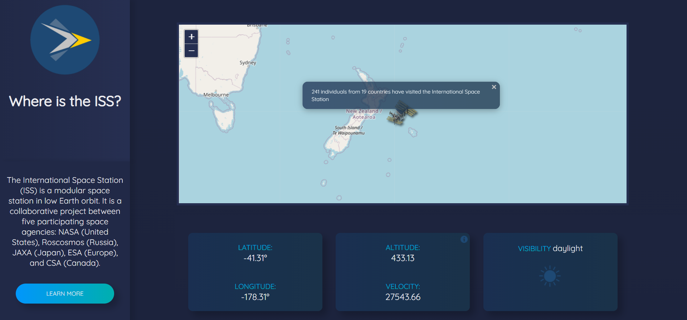

# International Space Station Tracker
> International Space Station Tracker made using https://api.wheretheiss.at API.

## Table of contents
* [Technologies](#technologies)
* [Screenshots](#screenshots)
* [Features](#features)
* [Status](#status)

## Technologies
* HTML
* CSS
* JavaScript
* Leaflet - www.leafletjs.com
* OpenStreetMap for tiles - www.openstreetmap.org

## Screenshots

## Features
List of features ready and TODOs for future development
* Displays real-time latitude, longitude, altitude, visibility, velocity of International Space Station
* Displays marker on map, where ISS is currently at.
* Once map marker is hovered, it will display a popup with random fun facts about the International Space Station

To-do list:
* Add media queries for all screen-sizes
* Refactor Code

## Status
Project is: in progress
